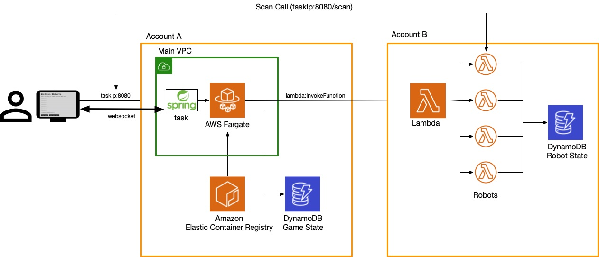
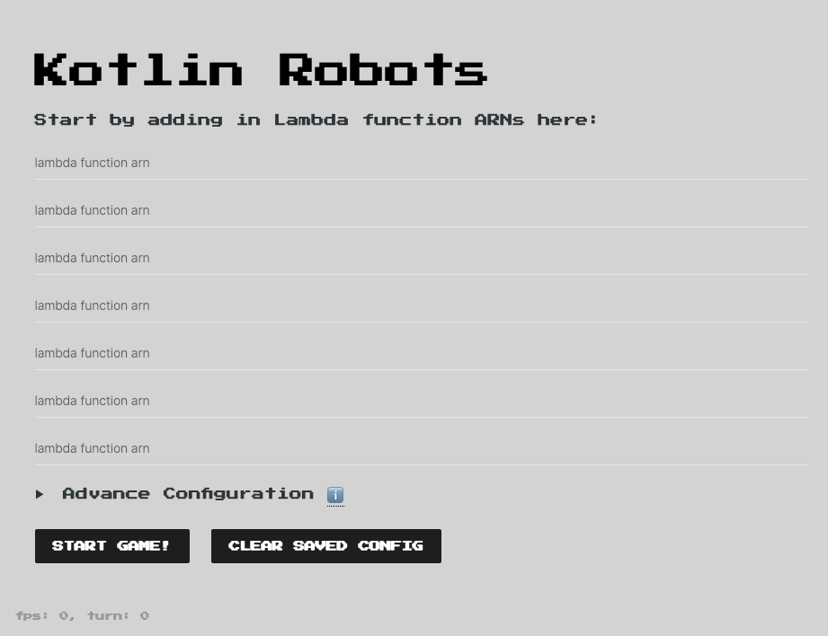

# KT-Robots

In KT-Robots, you program a battle robot that participates in a square game field. Each turn, the server invokes your robot's Lambda function to get its action until the robot wins or is destroyed.

**KT-Robots is a port of the [λ-Robots](https://github.com/LambdaSharp/LambdaRobots) and the 90s [P-Robots](https://corewar.co.uk/probots.htm) game to [kotlin](https://kotlinlang.org/) and [spring](https://spring.io/).**


 
## Level 0: Setup

<details>
<summary>Install tools & setup code</summary>

### Install the required tools
Make sure that you have the following tools installed on your computer.
<details>
<summary>List of required tools</summary>

- [Download and install the JDK 11](https://www.oracle.com/java/technologies/javase-jdk11-downloads.html)
- [Download and install the AWS CLI](https://docs.aws.amazon.com/cli/latest/userguide/install-cliv2.html)
- [Download and install Terraform 12](https://learn.hashicorp.com/terraform/getting-started/install.html)
</details>

### Setup AWS Account and CLI
The challenge requires an AWS account. AWS provides a [*Free Tier*](https://aws.amazon.com/free/), which is sufficient for the challenge.
<details>
<summary>Setup Instructions</summary>

- [Create an AWS Account](https://aws.amazon.com)
- [Configure your AWS profile with the AWS CLI for us-east-2 (Ohio)](https://docs.aws.amazon.com/cli/latest/userguide/cli-chap-configure.html#cli-quick-configuration)
</details>

> **NOTE:** 
> 
> For this challenge we will be using the US-EAST-2 region

### Clone Git Challenge Repository
<details>
<summary>Clone command</summary>

Run the following command to clone the KT-Robots challenge. 
```bash
git clone git@github.com:onema/kt-robots.git
cd kt-robots
```
</details>
</details>

## Level 1: Deploy functions and server
<details>
<summary>Deploy lambda functions and server</summary>
 
### Deploy using Terraform
From the command line use `gradlew` to run the `deployRobots` task: 
```bash
./gradlew deployRobots
```
<details>
<summary>Details</summary>

This task will 
- Compile the `lambda-robots` project
- Deploy the Lambda functions to your AWS account in the `us-east-2` (Ohio) region using Terraform
- The terraform code is in the `lambda-robots/infrastructure` directory
</details>

<details>
<summary>Use the InjelliJ Gradle Plugin</summary>

Or use the IntelliJ Gradle plugin to execute the task.


</details>


Once the command has finished running, the output shows you the ARN of the lambda robots.
```bash
Outputs:

HotShotRobotArn = arn:aws:lambda:us-east-2:123456789012:function:HotShot
RoboDogRobotArn = arn:aws:lambda:us-east-2:123456789012:function:RoboDog
YosemiteSamRobotArn = arn:aws:lambda:us-east-2:1234567890120:function:YosemiteSam
YourRobotARN = arn:aws:lambda:us-east-2:123456789012:function:BringYourOwnRobot
```

The `YourRobotARN` is the robot you will be working on!

> **NOTE:** 
> 
> Open `lambda-robots/src/main/kotlin/io.onema.ktrobots.lambda/functions/BringYourOwnRobot` and customize the `NAME` of your robot to distinguish it from other robots.

### Deploy the game server using Terraform 
From the command line use `gradlew` to run the `deployServer` task:
```bash
./gradlew deployServer
```
<details>
<summary>Details</summary>

This task creates and does a few things:

- Compile the server
- Deploy the game server to your AWS account in the `us-east-2` (Ohio) region using Terraform
- Creates a docker image that runs the server
- Create an ECR docker repository to host the image
- Pushes the image to the new docker repository
- Creates a Fargate cluster
- Creates a service and runs a task exposing port 80
- The terraform code is in the `server/infrastructure` directory


</details>

<details>
<summary>Getting the task IP Address</summary>
Once the deployment has finished, you have to log in to AWS to get the server IP:
- Amazon ECS
- Clusters
- ktrobots-server-cluster
- Tasks
- Select the task from the list
- Copy the Public IP
- You can also expand the task details and get a link to the CloudWatch logs

Once you have the IP paste it in your browser.
```bash
# For example
http://3.1.11.111/
```
</details>

<details>
<summary>Adding robots to game board</summary>

You can add the robot lambda function ARN to the game board client in the browser.  **You can add the ARN multiple times.**



Use the **Advance Configuration** to change any default settings.  Use **Clear Saved Config** to reset all settings to default.
</details>
</details>

## Level 2: Create an Attack Strategy

<details>
<summary>Develop your attack strategy</summary>

Now that you have deployed all the robots to your account add the ARN of the `TargetRobot` multiple times to the KT-Robots server to create targets.


Now update the behavior of `BringYourOwnRobot` to shoot down the target robots. 

### Use Luck - YosemiteSam 
For example, you can use luck, like `YosemiteSam`, which shoots in random directions.


<details>
<summary>YosemiteSam Details</summary>

Yosemite Sam is fast and trigger happy!

This robot chooses a random angle on every turn and fires a missile. It has an extra-large engine that helps avoid attacks and keeps its distance from the edges of the game board to avoid collisions!

| Equipment | Type              | Points | Details |
| --------- | ----------------- | ------ | ------- |
| Armor     | Light             | 1      |         |
| Engine    | Extra Large       | 4      |         |
| Radar     | Ultra Short Range | 0      |         |
| Missile   | Dart              | 0      |         |
| Total     |                   | 5      |         |
</details>


### Use Targeting - HotShot 
This robot uses the `scan()` method to find enemies and aim missiles at them. 


<details>
<summary>HotShot Details</summary>

HotShot is patient and accurate; it hardly ever misses its target!

This robot uses the `scan()` method to find targets. If it doesn't find targets, it moves to a new location. If it receives damage, it initiates an evasive move. 

| Equipment | Type        | Points | Details |
| --------- | ----------- | ------ | ------- |
| Armor     | Medium      | 2      |         |
| Engine    | Large       | 3      |         |
| Radar     | Short Range | 1      |         |
| Missile   | Javelin     | 2      |         |
| Total     |             | 8      |         |
</details>

### Chase like a dog - RoboDog 

This robot uses the `scan()` method to find enemies and chases them. 


<details>
<summary>RoboDog Details</summary>

RoboDog moves at random and scans what is right in front of it. When this dog bites, it won't let go!

This robot uses the `scan()` method to find targets right in from of it. If it does it adjust it's heading to move towards the target, this dog can hit you with a missile and with collision damage!

| Equipment | Type              | Points | Details |
| --------- | ----------------- | ------ | ------- |
| Armor     | Light             | 2      |         |
| Engine    | Standard          | 3      |         |
| Radar     | Ultra Short Range | 0      |         |
| Missile   | Cannon            | 3      |         |
| Total     |                   | 8      |         |
</details>

### TargetRobot 

This robot just sits down and waits to be hit. 


<details>
<summary>TargetRobot Details</summary>

Please don't be the target robot, and nobody wants to be the target robot!

| Equipment | Type              | Points | Details |
| --------- | ----------------- | ------ | ------- |
| Armor     | Heavy             | 3      |         |
| Engine    | Economy           | 0      |         |
| Radar     | Ultra Short Range | 0      |         |
| Missile   | Dart              | 0      |         |
| Total     |                   | 3      |         |
</details>


### Remember that 
- Other robots may be out of radar range, requiring your robot to move periodically. 
- Your robot can be damaged by its own missiles. 
- Check `gameInfo.farHitRange` to make sure your target is beyond the damage range. 
- If you don't mind a bit of self-inflicted pain, you can also use `gameInfo.nearHitRange` or even `game.directHitRange` instead.
</details>

## Level 3: Create an Evasion Strategy


<details>
<summary>Develop your evasion strategy</summary>
 
Add the `YosemiteSam` ARN twice to the KT-Robots server to create two attackers.

Now update the behavior of `BringYourOwnRobot` to avoid getting shot. 

<details>
<summary>Examples</summary>

You can be in continuous motion, like `YosemiteSam`, which zig-zags across the board, react to damage like `HotShot`,  or chase and ram into your opponents like `RoboDog`.

Beware that a robot cannot change heading without suddenly stopping if its speed exceeds `Robot.MaxSpeed`.
</details>
</details>

## Level 4: Take on the Champ

<details>
<summary>Test if your robot is good enough</summary>

Add the `HotShot` ARN once to the KT-Robots server to create one formidable opponent.

Consider modifying your robot build by tuning the 
- engine
- armor 
- missile
- radar 

Set the proper equipment to suit your attack and evasion strategies. 

**Remember that your build cannot exceed 8 points or your robot will be disqualified from the competition.**

</details>


## BOSS LEVEL: Enter the Multi-Team Deathmatch Competition

<details>
<summary>Test if your robot is the best</summary>


For the boss level, your opponent is every other team! Submit your robot ARN and see how well it fares.

**May the odds be ever in your favor!**
</details>


## Programming Reference

<details>
<summary>Reference Details</summary>

### Pre-Build Lambda-Robots

The `lambda-robots/src/main/kotlin/io.onema.ktrobots.lambda/functions/` folder contains additional robots that are deployed, these have different behaviors.
Next, we need a few robots to battle it out. 
* `TargetRobot`: This is a stationary robot for other robots to practice on.
* `YosemiteSam`: This robot runs around shooting in random directions as fast as it can.
* `HotShot`: This robot uses its radar to find other robots and fire at them. When hit, this robot moves around the board.
* `RoboDog`: This robot moves around shooting straight in front of it, when it finds a target it changes direction and chasses it, this robot will do collision damage.

### LambdaRobots SDK

Derive your Lambda-Robot from the `LambdaRobotFunction` provided by the SDK.

#### Abstract Methods
The base class requires two methods to be implemented:

| Method                                                                              | Description                                                                                                                                                                                                                                                    |
| ----------------------------------------------------------------------------------- | -------------------------------------------------------------------------------------------------------------------------------------------------------------------------------------------------------------------------------------------------------------- |
| `fun getBuild(state: LambdaRobotState): Pair<LambdaRobotBuild, LambdaRobotState>`   | This method returns the robot build information, including its name, armor, engine, missile, and radar types, and the robot state object. Note that a build cannot exceed 8 points by default, or the robot will be disqualified at the beginning of the match.
| `fun getAction(state: LambdaRobotState): Pair<LambdaRobotAction, LambdaRobotState>` | This method returns the actions taken by the robot during the turn and the updated robot state                                                                                                                                                                 |

#### Properties
The most commonly needed properties are readily available as properties from the base class. Additional information about the game or the robot is available via the `Game` and `Robot` properties, respectively.

| Property           | Type          | Description                                                                                                                                      |
| ------------------ | ------------- | ------------------------------------------------------------------------------------------------------------------------------------------------ |
| `gameInfo`         | `GameInfo`    | Game information data structure. _See below._                                                                                                    |
| `robot`            | `LambdaRobot` | Robot information data structure. _See below._                                                                                                   |

##### `Robot` Properties
| Property                      | Type                | Description                                                                               |
| ----------------------------- | ------------------- | ----------------------------------------------------------------------------------------- |
| `arn`                         | `string`            | Robot invokation identifier, either the AWS Lambda ARN or class namespace + class name.   |
| `id`                          | `string`            | Globally unique robot ID.                                                                 |
| `index`                       | `int`               | Index position of robot. Starts at `0`.                                                   |
| `name`                        | `string`            | Robot display name.                                                                       |
| `status`                      | `LambdaRobotStatus` | Robot status. Either `alive` or `dead`.                                                   |
| `x`                           | `double`            | Robot horizontal position.                                                                |
| `y`                           | `double`            | Robot vertical position.                                                                  |
| `heading`                     | `double`            | Robot heading. Between `0` and `360`. (degrees)                                           |
| `maxDamage`                   | `double`            | Maximum damage before the robot is destroyed.                                             |
| `maxSpeed`                    | `double`            | Engine Maximum speed - armor speed modifier for robot. (m/s)                              |
| `isAlive()`                   | `boolean`           | True if the status == LambdaRobotStatus.alive else false                                  |
| `canFire()`                   | `boolean`           | True if the reloadCoolDown == 0 else false                                                |
| `addDamageDealt()`            | `LambdaRobot`       | Increments the count to the totalDamageDealt                                              |
| `addHit()`                    | `LambdaRobot`       | Increments the count to the totalMissileHitCount                                          |
| `maxTurnSpeed`                | `double`            | Maximum speed at which the robot can change heading without a sudden stop. (m/s)          |
| `speed`                       | `double`            | Robot speed. Between `0` and `engine.maxSpeed`. (m/s)                                     |
| `reloadCoolDown`              | `double`            | Number of seconds before the robot can fire another missile. (s)                          |
| `targetHeading`               | `double`            | Desired heading for robot. The heading will be adjusted accordingly every turn. (degrees) |
| `targetSpeed`                 | `double`            | Desired speed for robot. The current speed will be adjusted accordingly every turn. (m/s) |
| `timeOfDeathGameTurn`         | `int`               | Game turn during which the robot died. `-1` if robot is alive.                            |
| `totalCollisions`             | `int`               | Number of collisions with walls or other robots during match.                             |
| `totalDamageDealt`            | `double`            | Damage dealt by missiles during match.                                                    |
| `totalKills`                  | `int`               | Number of confirmed kills during match.                                                   |
| `totalMissileFiredCount`      | `int`               | Number of missiles fired by robot during match.                                           |
| `totalMissileHitCount`        | `int`               | Number of missiles that hit a target during match.                                        |
| `totalTravelDistance`         | `double`            | Total distance traveled by robot during the match. (m)                                    |
| `damage`                      | `double`            | Accumulated robot damage. Between `0` and `MaxDamage`.                                    |
| `armor.deceleration`          | `double`            | Deceleration when speeding up. (m/s^2)                                                    |
| `armor.collisionDamage`       | `double`            | Amount of damage the robot receives from a collision.                                     |
| `armor.directHitDamage`       | `double`            | Amount of damage the robot receives from a direct hit.                                    |
| `armor.farHitDamage`          | `double`            | Amount of damage the robot receives from a far hit.                                       |
| `armor.nearHitDamage`         | `double`            | Amount of damage the robot receives from a near hit.                                      |
| `engine.acceleration`         | `double`            | Acceleration when speeding up. (m/s^2)                                                    |
| `engine.maxSpeed`             | `double`            | Maximum speed for robot. (m/s)                                                            |
| `missile.directHitDamageBonus`| `double`            | Bonus damage on target for a direct hit.                                                  |
| `missile.farHitDamageBonus`   | `double`            | Bonus damage on target for a far hit.                                                     |
| `missile.nearHitDamageBonus`  | `double`            | Bonus damage on target for a near hit.                                                    |
| `missile.range`               | `double`            | Maximum range for missile. (m)                                                            |
| `missile.reloadCooldown`      | `double`            | Number of seconds between each missile launch. (s)                                        |
| `missile.velocity`            | `double`            | Travel velocity for missile. (m/s)                                                        |
| `radar.maxResolution`         | `double`            | Maximum degrees the radar can scan beyond the selected heading. (degrees)                 |
| `radar.range`                 | `double`            | Maximum range at which the radar can detect an opponent. (m)                              |

##### `GameInfo` Properties
| Property         | Type     | Description                                             |
| ---------------- | -------- | ------------------------------------------------------- |
| `boardWidth`     | `double` | Width of the game board.                                |
| `boardHeight`    | `double` | Height of the game board.                               |
| `secondsPerTurn` | `double` | Number of seconds elapsed per game turn.                |
| `directHitRange` | `double` | Distance for missile impact to count as direct hit.     |
| `nearHitRange`   | `double` | Distance for missile impact to count as near hit.       |
| `farHitRange`    | `double` | Distance for missile impact to count as far hit.        |
| `collisionRange` | `double` | Distance between robots to count as a collision.        |
| `gameTurn`       | `int`    | Current game turn. Starts at `1`.                       |
| `maxGameTurns`   | `int`    | Maximum number of turns before the game ends in a draw. |
| `maxBuildPoints` | `int`    | Maximum number of build points a robot can use.         |
| `apiUrl`         | `string` | URL for game server API.                                |

##### `LambdaRobotAction` Properties
| Property              | Type     | Description                                               |
| --------------------- | -------- | --------------------------------------------------------- |
| `speed`               | `double` | Update the robot speed up to `engine.maxSpeed`.           |
| `heading`             | `double` | Update the robot heading.                                 |
| `fireMissileHeading`  | `double` | Heading of a new fired missile.                           |
| `fireMissileDistance` | `double` | Distance a fired missile can travel up to `missile.range`.|
| `fired`               | `boolean`| Whether a missile was fired or not.                       |
| `arrivedAtDestination`| `boolean`| Whether or not the robot arrived at it's destination.     |

#### Primary Methods
The following methods represent the core capabilities of the robot. They are used to move, fire missiles, and scan their surroundings.

| Method                                       | ReturnType           | Description                                              |
| -------------------------------------------- | -------------------- | -------------------------------------------------------- |
| `scan(heading: Double, resolution: Double)`  | `ScanEnemiesResponse`| Scan the game board in a given deading and resolution. The resolution specifies in the scan arc centered on `heading` with +/- `resolution` tolerance. The max resolution is limited to `Robot.RadarMaxResolution`.|
| `angleToXY(x: Double, y: Double)`            | `Double`             | Determine the angel in degrees relative to the current robot position. Returns a value between -180 and 180 degrees.|
| `distanceToXY(x: Double, y: Double)`         | `Double`             | Determine the distance to X, Y relative to the current robot position.|
| `normalizeAngle(angle: Double)`              | `Double`             | Normalize angle to be between -180 and 180.|
| `getNewHeading(minDistanceToEdge: Int = 100)`| `Int`                | Check if the robot needs to turn based on a minimum distance to the edge and return a new heading if it does.|

#### Support extension functions
The following methods are available to make some operations easier:

| LambdaRobotAction Extension Functions                               | ReturnType         | Description                                              |
| ------------------------------------------------------------------- | ------------------ | -------------------------------------------------------- |
| `LambdaRobotAction.fireMissile(heading: Double, distance: Double)`  | `LambdaRobotAction`| Fire a missile in a given direction with impact at a given distance. A missile can only be fired if `Robot.ReloadCoolDown` is `0`. |
| `LambdaRobotAction.fireMissileToXY(x: Double, y: Double)`           | `LambdaRobotAction`| Convenience function to fire a missile at a specific set of coordinages.|
| `LambdaRobotAction.moveToXY(x: Double, y: Double)`                  | `LambdaRobotAction`| Convenience method to move the robot to a specific location.     |

| LambdaRobotState Extension Functions                               | ReturnType         | Description                                              |
| ------------------------------------------------------------------ | ------------------ | -------------------------------------------------------- |
| `LambdaRobotState.initialize()`                                    | `LambdaRobotState` | Convenience function to set the state to initialized.    |


### Robot Build

**By default, 8 build points are available to allocate in any fashion. The robot is disqualified if its build exceeds the maximum number of build points.**

#### Radar


| Radar Type       | Radar Range  | Radar Resolution | Points |
| ---------------- | ------------ | ---------------- | ------ |
| ultraShortRange  | 200 meters   | 45 degrees       | 0      |
| shortRange       | 400 meters   | 20 degrees       | 1      |
| midRange         | 600 meters   | 10 degrees       | 2      |
| longRange        | 800 meters   | 8 degrees        | 3      |
| ultraLongRange   | 1,000 meters | 5 degrees        | 4      |

#### Engine


| Engine Type      | Max. Speed | Acceleration | Points |
| ---------------- | ---------- | ------------ | ------ |
| economy          | 60 m/s     | 7 m/s^2      | 0      |
| compact          | 80 m/s     | 8 m/s^2      | 1      |
| standard         | 100 m/s    | 10 m/s^2     | 2      |
| large            | 120 m/s    | 12 m/s^2     | 3      |
| extraLarge       | 140 m/s    | 13 m/s^2     | 4      |

#### Armor


| Armor Type     | Direct Hit | Near Hit | Far Hit | Collision | Max. Speed | Deceleration | Points |
| -------------- | ---------- | -------- | ------- | --------- | ---------- | ------------ | ------ |
| ultraLight     | 50         | 25       | 12      | 10        | +35 m/s    | 30 m/s^2     | 0      |
| light          | 16         | 8        | 4       | 3         | +25 m/s    | 25 m/s^2     | 1      |
| medium         | 8          | 4        | 2       | 2         | -          | 20 m/s^2     | 2      |
| heavy          | 4          | 2        | 1       | 1         | -25 m/s    | 15 m/s^2     | 3      |
| ultraHeavy     | 2          | 1        | 0       | 1         | -45 m/s    | 10 m/s^2     | 4      |

#### Missile


When shooting a missile a heading and a range must be set. Depending on the missile, the range cannot exceed the Max. Range.
Each missile causes damage only when it reaches its set range, none otherwise. When a missile explodes it can cause up to three types of damage:

| **Direct hit damage**                             | **Near hit damage**                            | **Far hit damage**                           |
| ------------------------------------------------- | ---------------------------------------------- | -------------------------------------------- | 
| |  |  | 

| Missile Type    | Max. Range   | Velocity | Direct Hit Bonus | Near Hit Bonus | Far Hit Bonus | Cooldown | Points |
| --------------- | ------------ | -------- | ---------------- | -------------- | ------------- | -------- | ------ |
| dart            | 1,200 meters | 250 m/s  | 0                | 0              | 0             | 0 sec    | 0      |
| arrow           | 900 meters   | 200 m/s  | 1                | 1              | 0             | 1 sec    | 1      |
| javelin         | 700 meters   | 150 m/s  | 3                | 2              | 1             | 2 sec    | 2      |
| cannon          | 500 meters   | 100 m/s  | 6                | 4              | 2             | 3 sec    | 3      |
| BFG             | 350 meters   | 75 m/s   | 12               | 8              | 4             | 5 sec    | 4      |

</details>

# DON'T FORGET TO CLEAN UP!

The ECS Fargate task run on spot instances and this is the cost for running the server:

- 512 vCPU $0.00639685 per hour
- 1024 MiB $0.00140484 per hour

While it will cost you cents to run this task for a few hours, you want to turn it of after you are done with the challenge.
Use the following commands to destroy all the resources:

```bash
./gradlew destroyRobots
./gradlew destroyServer
```
